# Request & Response Flow Architecture

This document visualizes how data (`req` and `res`) travels through the **Leadership Dojo** standalone module.

## 1. High-Level Sequence Diagram

The "Waterfall" flow from the user's browser, through the backend layers, and back.

```mermaid
sequenceDiagram
    participant Browser as 🌐 Browser (Frontend)
    participant Server as 🚀 Server (app.js)
    participant Route as 道 Router (dojoRoutes)
    participant Controller as 🎮 Controller (dojoController)
    participant Service as 🧠 Service (chatService/aiService)
    participant DB as 📁 Database (MongoDB)

    Note over Browser, DB: Example: User sends a message in Simulation
    
    Browser->>Server: HTTP POST /dojo/respond {sessionId, message}
    Server->>Route: Match "/dojo" -> Match "/respond"
    Route->>Controller: Call respondToScenario(req, res)
    
    Controller->>DB: Fetch ChatSession by ID
    Controller->>Service: evaluateResponse(userText, role, context)
    Service->>Service: Call AI (aiService) for scores/mood
    Service-->>Controller: Return {competencyScores, moodDelta}
    
    Controller->>DB: Update Session (Messages, Metrics, Mood)
    Controller->>Service: generateResponse(history, persona)
    Service-->>Controller: Return "AI reply text"
    
    Controller-->>Browser: JSON Response {message, moodLevel, mcqOptions}
    
    Note over Browser: Frontend updates Chat Feed & Mood Bar
```

---

## 2. Microscopic Step-by-Step

### Step 1: The Trigger (Frontend)
*   **File:** [dojo-simulation.ejs](file:///c:/Users/shaik/Downloads/dojo-app-backend-frontend/frontend/views/dojo-simulation.ejs)
*   **The `req` (Request):** When a user clicks an MCQ or typing a message, `handleResponse()` creates a `fetch` request.
*   **Data Sent:** `sessionId`, `message`, and optionally `mcqChoice`.

### Step 2: The Routing (Backend Entry)
*   **File:** [app.js](file:///c:/Users/shaik/Downloads/dojo-app-backend-frontend/backend/app.js) & [dojoRoutes.js](file:///c:/Users/shaik/Downloads/dojo-app-backend-frontend/backend/routes/dojoRoutes.js)
*   **The Path:** `app.js` catches the request → Hands it to `dojoRoutes` → Hands it to `dojoController`.
*   **Identity Layer:** [authMiddleware.js](file:///c:/Users/shaik/Downloads/dojo-app-backend-frontend/backend/middleware/authMiddleware.js) runs first, attaching a **Dummy User** (`req.user`) so current session logic doesn't crash.

### Step 3: The Brain (Controller)
*   **File:** [dojoController.js](file:///c:/Users/shaik/Downloads/dojo-app-backend-frontend/backend/controllers/dojoController.js)
*   **The Logic:** This file coordinates the database and AI services.
    1.  **Read `req`**: Pulls data from the request body.
    2.  **DB Fetch**: Loads the [ChatSession](file:///c:/Users/shaik/Downloads/dojo-app-backend-frontend/backend/models/ChatSession.js) from MongoDB.
    3.  **Process Logic**: Decides if it needs to grade the response or just generate a reply.

### Step 4: The Intelligence (Service)
*   **Files:** [chatService.js](file:///c:/Users/shaik/Downloads/dojo-app-backend-frontend/backend/services/chatService.js) & [aiService.js](file:///c:/Users/shaik/Downloads/dojo-app-backend-frontend/backend/services/aiService.js)
*   **The Generation:** 
    *   `chatService` looks at [roleCompetencies.js](file:///c:/Users/shaik/Downloads/dojo-app-backend-frontend/backend/config/roleCompetencies.js) to know what to grade.
    *   `aiService` communicates with external LLMs (Groq/Gemini).

### Step 5: The Delivery (Response)
*   **File:** [dojoController.js](file:///c:/Users/shaik/Downloads/dojo-app-backend-frontend/backend/controllers/dojoController.js)
*   **The `res` (Response):** The controller sends a `res.json()` back.
*   **Data Returned:**
    *   `message`: The character's AI response.
    *   `moodLevel`: The new state of the stakeholder (angry/calm).
    *   `mcqOptions`: The next 3 choices for the user.

---

## 3. Data Flow Cheat-Sheet

| Phase | Responsibility | Primary Data Object | Key File |
| :--- | :--- | :--- | :--- |
| **Input** | Catch user clicks/text | `req.body` | `dojo-simulation.ejs` |
| **Identity** | Ensure a user exists | `req.user` | `authMiddleware.js` |
| **Validation** | Ensure data is stored | `mongoose.Session` | `dojoController.js` |
| **Grading** | Evaluate soft skills | `competencyScores` | `chatService.js` |
| **Output** | Update the user's screen | `res.json` | `dojoController.js` |
